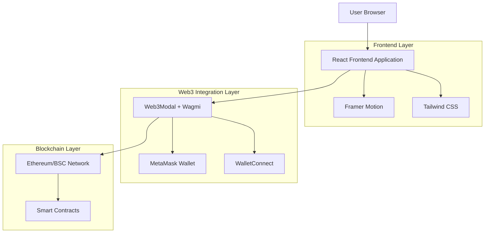
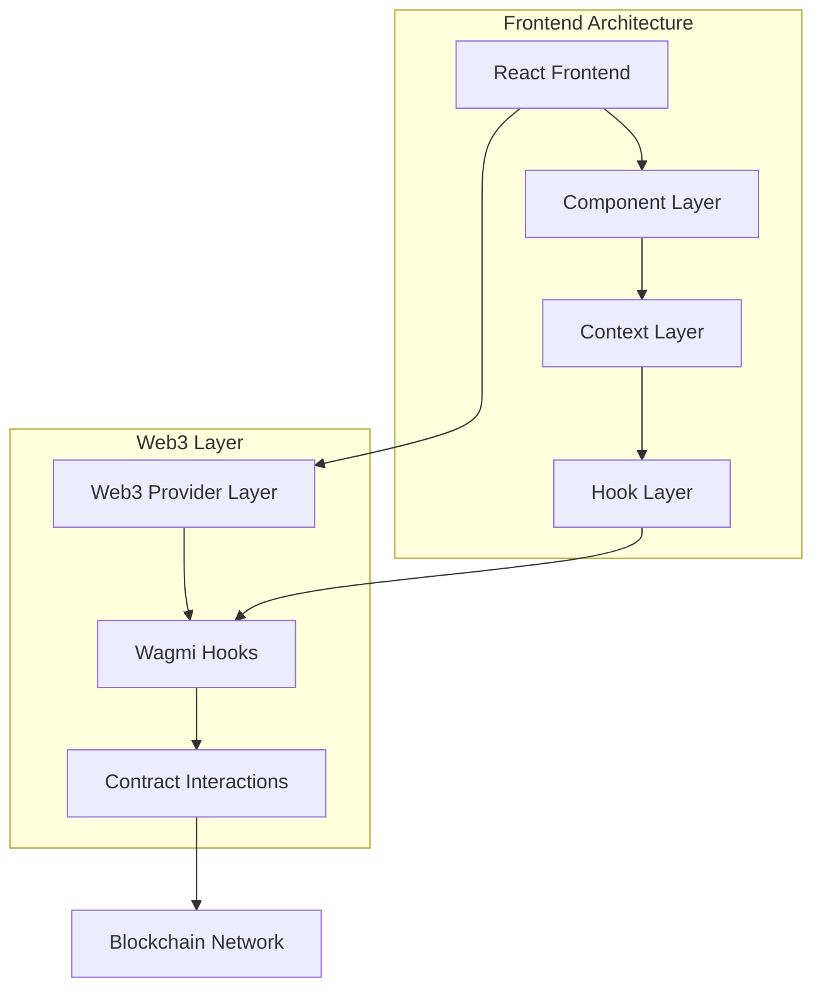
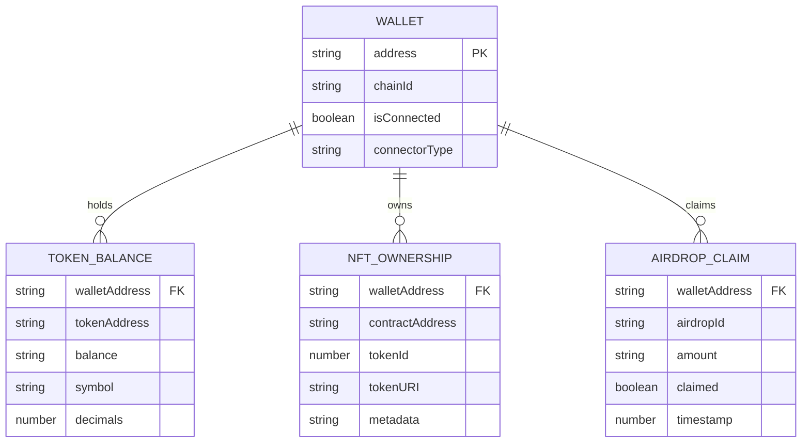

# YesCoin Web3 技术架构文档

## 1. Architecture design



## 2. Technology Description

- Frontend: React@18 + Vite@5 + Tailwind CSS@3 + Framer Motion@11
- Web3 Integration: @web3modal/wagmi@4 + wagmi@2 + viem@2
- Wallet Support: MetaMask + WalletConnect@2
- Styling: Tailwind CSS + Custom Pixel Art Components
- Animation: Framer Motion
- Build Tool: Vite

## 3. Route definitions

| Route | Purpose |
|-------|----------|
| / | Home page, 项目介绍和钱包连接入口 |
| /token-info | Token Info page, 代币详细信息和价格数据 |
| /nft | NFT page, NFT展示和铸造功能 |
| /airdrop | Airdrop page, 空投活动和领取功能 |
| /faq | FAQ page, 常见问题和使用指南 |

## 4. API definitions

### 4.1 Web3 Hooks API

**钱包连接相关**
```typescript
// useAccount Hook
interface AccountData {
  address?: string
  isConnected: boolean
  isConnecting: boolean
  isDisconnected: boolean
}

// useConnect Hook
interface ConnectData {
  connect: (connector: Connector) => void
  connectors: Connector[]
  isLoading: boolean
  pendingConnector?: Connector
}

// useDisconnect Hook
interface DisconnectData {
  disconnect: () => void
}
```

**代币余额查询**
```typescript
// useBalance Hook
interface BalanceData {
  data?: {
    decimals: number
    formatted: string
    symbol: string
    value: bigint
  }
  isError: boolean
  isLoading: boolean
}
```

**合约交互**
```typescript
// useContractRead Hook
interface ContractReadData {
  data?: any
  isError: boolean
  isLoading: boolean
  refetch: () => void
}

// useContractWrite Hook
interface ContractWriteData {
  data?: any
  isError: boolean
  isLoading: boolean
  write: () => void
}
```

### 4.2 Smart Contract Interfaces

**ERC20 Token Contract**
```typescript
interface TokenContract {
  name(): Promise<string>
  symbol(): Promise<string>
  decimals(): Promise<number>
  totalSupply(): Promise<bigint>
  balanceOf(account: string): Promise<bigint>
  transfer(to: string, amount: bigint): Promise<boolean>
}
```

**NFT Contract (ERC721)**
```typescript
interface NFTContract {
  mint(to: string): Promise<number>
  tokenURI(tokenId: number): Promise<string>
  ownerOf(tokenId: number): Promise<string>
  balanceOf(owner: string): Promise<number>
}
```

**Airdrop Contract**
```typescript
interface AirdropContract {
  claim(): Promise<boolean>
  isEligible(account: string): Promise<boolean>
  claimedAmount(account: string): Promise<bigint>
}
```

## 5. Server architecture diagram

由于项目采用纯前端架构，不需要传统的服务器端，所有数据通过区块链网络获取：



## 6. Data model

### 6.1 Data model definition



### 6.2 Data Definition Language

**Web3 Configuration**
```typescript
// wagmi.config.ts
import { createConfig, http } from 'wagmi'
import { mainnet, bsc, bscTestnet } from 'wagmi/chains'
import { walletConnect, metaMask } from 'wagmi/connectors'

export const config = createConfig({
  chains: [mainnet, bsc, bscTestnet],
  connectors: [
    metaMask(),
    walletConnect({
      projectId: process.env.VITE_WALLETCONNECT_PROJECT_ID,
    }),
  ],
  transports: {
    [mainnet.id]: http(),
    [bsc.id]: http(),
    [bscTestnet.id]: http(),
  },
})
```

**Contract Addresses Configuration**
```typescript
// contracts.config.ts
export const CONTRACTS = {
  TOKEN: {
    address: '0x...', // YesCoin Token Contract
    abi: [...], // ERC20 ABI
  },
  NFT: {
    address: '0x...', // YesCoin NFT Contract
    abi: [...], // ERC721 ABI
  },
  AIRDROP: {
    address: '0x...', // Airdrop Contract
    abi: [...], // Custom Airdrop ABI
  },
} as const
```

**Environment Variables**
```bash
# .env
VITE_WALLETCONNECT_PROJECT_ID=your_project_id_here
VITE_CHAIN_ID=56  # BSC Mainnet
VITE_RPC_URL=https://bsc-dataseed.binance.org/
```

**Package Dependencies**
```json
{
  "dependencies": {
    "@web3modal/wagmi": "^4.1.0",
    "wagmi": "^2.5.0",
    "viem": "^2.7.0",
    "@tanstack/react-query": "^5.0.0"
  }
}
```