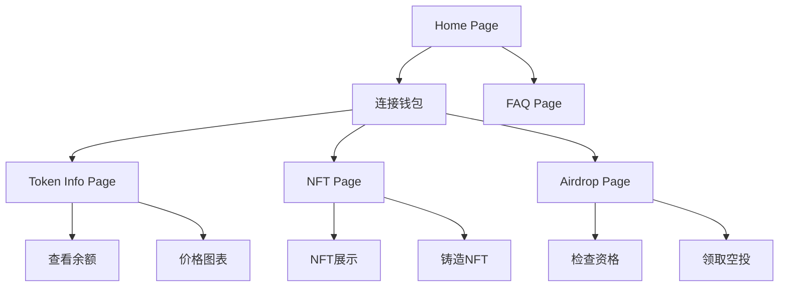

# YesCoin Web3 功能集成产品需求文档

## 1. Product Overview

YesCoin是一个像素艺术风格的Web3项目，基于React + Tailwind + Vite + Framer Motion技术栈构建。项目需要集成完整的Web3功能，包括钱包连接、代币信息展示、NFT功能和空投机制，为用户提供完整的去中心化应用体验。

目标是在现有像素艺术UI基础上，无缝集成Web3功能，让用户能够通过MetaMask和WalletConnect等钱包与区块链进行交互。

## 2. Core Features

### 2.1 User Roles

| Role | Registration Method | Core Permissions |
|------|---------------------|------------------|
| 访客用户 | 无需注册 | 浏览项目信息、查看代币数据、阅读FAQ |
| 连接钱包用户 | 通过MetaMask/WalletConnect连接 | 查看个人资产、参与空投、铸造NFT、代币交互 |

### 2.2 Feature Module

我们的YesCoin Web3应用包含以下主要页面：

1. **Home页面**: 项目介绍、钱包连接入口、核心数据展示
2. **Token Info页面**: 代币详细信息、价格图表、持仓查询
3. **NFT页面**: NFT展示、铸造功能、个人收藏
4. **Airdrop页面**: 空投活动、资格检查、领取功能
5. **FAQ页面**: 常见问题、使用指南、技术支持

### 2.3 Page Details

| Page Name | Module Name | Feature description |
|-----------|-------------|---------------------|
| Home页面 | 钱包连接模块 | 显示连接状态、支持MetaMask和WalletConnect、断开连接功能 |
| Home页面 | 项目概览模块 | 展示项目介绍、核心数据、团队信息 |
| Home页面 | 导航模块 | 像素风格导航栏、页面跳转、响应式菜单 |
| Token Info页面 | 代币信息模块 | 显示代币价格、市值、流通量、合约地址 |
| Token Info页面 | 持仓查询模块 | 查询用户代币余额、交易历史 |
| Token Info页面 | 价格图表模块 | 实时价格走势、历史数据可视化 |
| NFT页面 | NFT展示模块 | 展示NFT集合、稀有度、属性信息 |
| NFT页面 | 铸造功能模块 | NFT铸造界面、支付确认、铸造状态 |
| NFT页面 | 个人收藏模块 | 用户拥有的NFT、转账功能 |
| Airdrop页面 | 资格检查模块 | 验证用户空投资格、条件展示 |
| Airdrop页面 | 领取功能模块 | 空投代币领取、交易确认 |
| Airdrop页面 | 活动列表模块 | 当前和历史空投活动 |
| FAQ页面 | 问题分类模块 | 钱包连接、代币、NFT、空投相关问题 |
| FAQ页面 | 搜索功能模块 | 问题搜索、关键词匹配 |

## 3. Core Process

**主要用户操作流程：**

1. **钱包连接流程**: 用户访问首页 → 点击连接钱包 → 选择钱包类型(MetaMask/WalletConnect) → 授权连接 → 显示钱包地址

2. **代币查询流程**: 连接钱包 → 进入Token Info页面 → 自动加载用户余额 → 查看代币详情和价格信息

3. **NFT铸造流程**: 连接钱包 → 进入NFT页面 → 选择要铸造的NFT → 确认支付 → 等待交易确认 → 铸造成功

4. **空投领取流程**: 连接钱包 → 进入Airdrop页面 → 检查资格 → 点击领取 → 确认交易 → 代币到账

## 4. User Interface Design

### 4.1 Design Style

- **主色调**: 亮金黄色(#FFD700)作为主要CTA颜色，棕色(#4A423B)作为边框和文字
- **次要色彩**: 橙色(#F28C28)、洋红色(#FF0077)作为强调色
- **背景色**: 米白色(#F8F2ED)主背景，卡片背景(#EFE8E1)
- **按钮样式**: 像素风格边框、悬停缩放效果、像素阴影
- **字体**: Press Start 2P作为主要标题字体，Silkscreen作为像素字体
- **布局风格**: 卡片式布局、像素边框、噪点纹理背景
- **图标样式**: 像素艺术风格图标、SVG格式、统一尺寸

### 4.2 Page Design Overview

| Page Name | Module Name | UI Elements |
|-----------|-------------|-------------|
| Home页面 | 钱包连接模块 | 亮金黄色连接按钮、Press Start 2P字体、像素边框、悬停动画效果 |
| Home页面 | 项目概览模块 | 卡片式布局、噪点纹理背景、像素阴影、Framer Motion动画 |
| Token Info页面 | 代币信息模块 | 数据卡片、实时更新动画、颜色编码的涨跌指示 |
| Token Info页面 | 价格图表模块 | 像素风格图表、金色高亮线条、交互式数据点 |
| NFT页面 | NFT展示模块 | 网格布局、悬停放大效果、稀有度标签、像素边框 |
| NFT页面 | 铸造功能模块 | 大型CTA按钮、进度指示器、交易状态动画 |
| Airdrop页面 | 资格检查模块 | 状态指示器、条件列表、进度条、成功/失败状态 |
| Airdrop页面 | 领取功能模块 | 突出的领取按钮、倒计时器、交易确认弹窗 |

### 4.3 Responsiveness

项目采用移动优先的响应式设计，支持桌面端和移动端访问。移动端优化钱包连接体验，支持WalletConnect的移动钱包扫码连接。触摸交互针对移动设备进行优化，包括按钮大小、间距和手势操作。